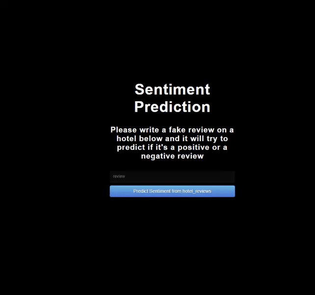
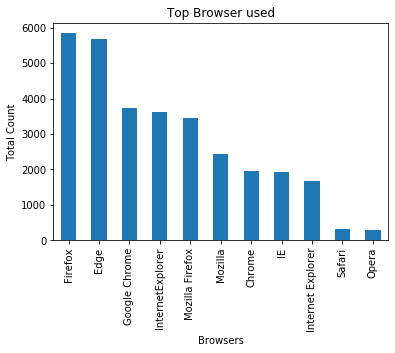
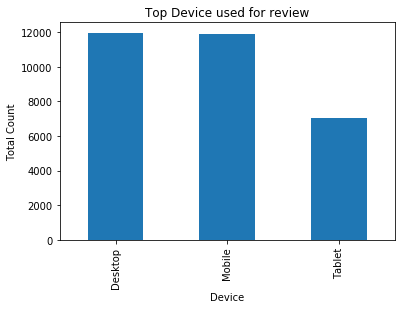
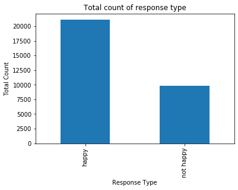
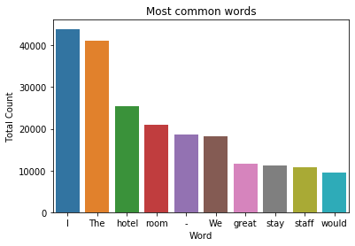
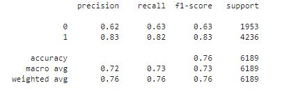
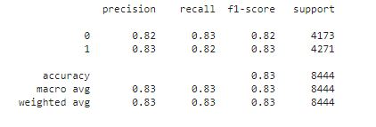

# Hotel reviews prediction using Sentiment Analysis

- Hotel review dataset : <a href="https://www.kaggle.com/anu0012/hotel-review">https://www.kaggle.com/anu0012/hotel-review</a>
- View live project: <a href="https://sentiment-prediction-review.herokuapp.com/">https://sentiment-prediction-review.herokuapp.com/</a>

*Live project link may take a few seconds to load*

**Info about the model:** 
- Bi-directional LSTM was used to train the model. 
- Accuracy was 78% on validaiton set. Works well with long reviews. 
- Will struggle a bit on short reviews, but works well majority of the time.
- Has some issues classifying bad reviews sometimes, due to lack of negative review data. 

### Exploratory Data analysis

#### Browsers used data

- From the hotel review dataset, Firefox is shown to be the most popular browser for reviewers, where Edge and Google Chrome came 2nd and 3rd respectively.

#### Top devices used

- Moving on towards the devices used by the reviewers. Desktop and Mobile were the most used device to write a review in, which makes sense and Tablet fell to last place.

#### Response type

- Towards the response type, this is where we will look at the review and their corresponding sentiment. The data has an abumdence of happy response type compared to not happy. Therefore, there is mismatch on data types. The model will probably be able to predict happy reviews for the hotel better compared to not happy. To combat this there might be a need to gather more data on not happy responce type. But for now, I will try it without this. There might be some accruracy loss due to the mismatch of data.

#### Total words in a review

- It seems that reviews that were given were generally very long, with around 40-80 words were the most in a review. This is similar to both the happy and not happy reviews.

#### Common words

- Hotel, room, stay, staff sneaking it's way in. The word "great" being the most common, due to high amounts of happy reviews.

#### Ngram analysis of four pair words

- Reviewers mostly talking about the fronk desk, first point of contact and also of the staff members. Also more review regarding the room that they were staying in. 

### Fixing the data mismatch issue and the model

- Due to having more positive reviews than negative review. The model which was trained on a bi-directional LSTM was able to predict postive reviews much better and had trouble when negative reviews were written.

- Looking at the classification report below, we can see that the model is only able to recall 63% of the data from 1953 validation data set. For the  positive prediction it is able to recall 83% of the 4236 positive reviews. Overall the model gives 76% accuracy. But fails on negative reviews.

- To combat data mismatch I had to get additional data on the negative review. Therefore, I gathered the reviews from this dataset. https://www.kaggle.com/jiashenliu/515k-hotel-reviews-data-in-europe

- After data gathering, the positive and negative data set were checked to have the same amount. In total, 42,218 reviews wer used and 21,109 set were in the positive and negative reviews.

1 represents positive review and 0 represents negative reviews.

- After addition of negative data, the bi-directional model was used again. However it's score was worse compared to the previous model. Therefore, a CNN model was used and it provided better results. With an overall accuracy of 83%, which is a huge boost compared to the previous model. With the recall on negative increasing to 83% on 4173 validation set and 82% on the positive review. 

