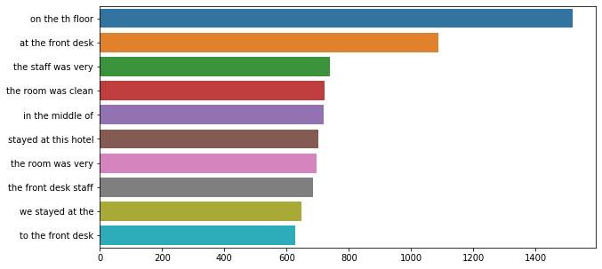

# Hotel reviews prediction using Sentiment Analysis

- Hotel review dataset : https://www.kaggle.com/anu0012/hotel-review
- View live project: https://sentiment-prediction-review.herokuapp.com/

*Live project link may take a few seconds to load*

**Info about the model:** 
- Bi-directional LSTM was used to train the model. 
- Accuracy was 78% on validaiton set. Works well with long reviews. Will struggle a bit on short reviews, but works well majority of the time.
- Has some issues classifying bad reviews sometimes, due to lack of negative review data. 

### Exploratory Data analysis

#### Browsers used data

- From the hotel review dataset, Firefox is shown to be the most popular browser for reviewers, where Edge and Google Chrome came 2nd and 3rd respectively.

#### Top devices used

- Moving on towards the devices used by the reviewers. Desktop and Mobile were the most used device to write a review in, which makes sense and Tablet fell to last place.

#### Top devices used

- Towards the response type, this is where we will look at the review and their corresponding sentiment. The data has an abumdence of happy response type compared to not happy. Therefore, there is mismatch on data types. The model will probably be able to predict happy reviews for the hotel better compared to not happy. To combat this there might be a need to gather more data on not happy responce type. But for now, I will try it without this. There might be some accruracy loss due to the mismatch of data.

#### Response type

- It seems that reviews that were given were generally very long, with around 40-80 words were the most in a review. This is similar to both the happy and not happy reviews.

#### Common words

- Hotel, room, stay, staff sneaking it's way in. The word "great" being the most common, due to high amounts of happy reviews.

#### Ngram analysis of four pair words

- Reviewers mostly talking about the fronk desk, first point of contact and also of the staff members. Also more review regarding the room that they were staying in. 
